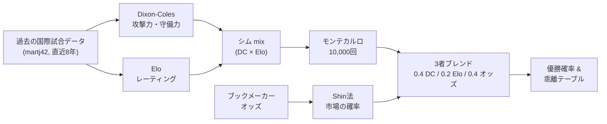
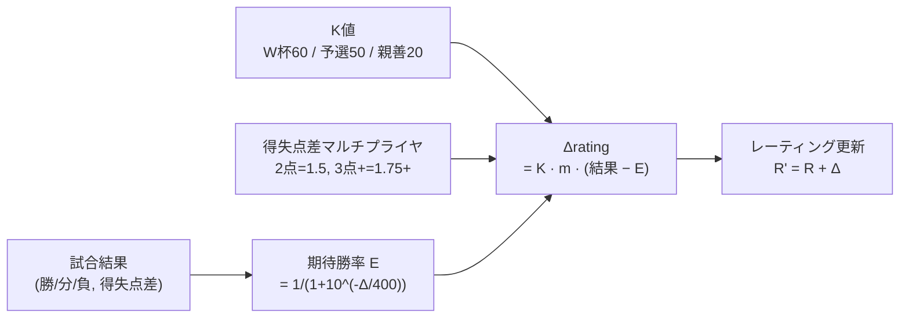
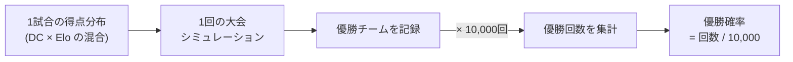
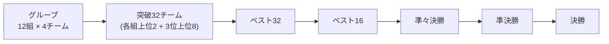

:::message
本文は予測システムの実装と実データ（2026-06-20 時点のスナップショット、グループステージ第30試合終了時）に基づいて書いています。数値は大会の進行とともに変わるため、公開時に最新のスナップショットで更新してください。`// TODO: 確認` は私（筆者）が最終確認・加筆する箇所です。
:::

## はじめに

この記事は「2026 FIFAワールドカップの優勝確率を、どう統計モデルで推定し、それを**市場（ブックメーカーのオッズ）とどう比較・検証するか**」という分析の記事です。サイト構築やデプロイの話は脇に置き、モデルの設計思想・シミュレーション手法・精度検証、そして「モデルと市場の見立てがどこで食い違うか」の読み解きに焦点を当てます。

予測の出し方をひとことで言えば、**性質の異なる3つのモデルをブレンドし、残り試合を10,000回シミュレーションして優勝回数を数える**というものです。そのうえで、自作モデルが弾き出した優勝確率を、ブックメーカーのオッズから逆算した「市場の確率」と並べます。両者が大きくズレるチームこそ、この大会のいちばんの見どころになります。

- 本番サイト: https://world-cup-five-ochre.vercel.app

全体の流れは次のとおりです。過去の国際試合データから3つのモデルを学習し、チームレベルで重み付き平均（ブレンド）したうえで、トーナメントをモンテカルロで回します。



## 何を予測するのか・前提条件

予測対象は、各チームの「グループ突破 / ベスト16 / 準々決勝 / 準決勝 / 決勝進出 / **優勝**」の確率です。メインの読み物は優勝確率ですが、内部では各ステージ到達確率もすべて出しています。

前提条件を最初に固めておきます。

- **大会フォーマット**: 48チーム・12グループ（A〜L）。各組上位2チームに加え、12組の3位のうち成績上位**8**チームがラウンド32へ進みます（FIFA公式ブラケット、試合73〜104）。
- **会場の扱い**: 米・加・墨の中立地開催。原則ホームアドバンテージはゼロで、開催3か国のみ準ホーム係数（`host_advantage_factor = 0.5`、フィット済みホーム補正の半分）を適用します。
- **学習データ範囲**: 基準日から過去**8年**（`years_back: 8`）の国際試合スコア。直近ほど重く扱います（後述の時間減衰）。
- **評価軸**: 確率予測なので「当たった/外れた」では測りません。**Brier score**・**log loss**・**calibration（予測確率と実現頻度の一致度）**で評価します（第6章）。

ここで用語を1つ整理しておきます。本記事では2種類の合成が登場し、混同しやすいためです。

- **シム(mix)** … 試合レベルで Dixon-Coles と Elo を混合した試合モデルを、モンテカルロに通して得た優勝確率です。
- **ブレンド** … チームレベルで、その *シム(mix)* とオッズ(Shin) を `0.4 / 0.2 / 0.4` で混ぜた最終確率です。

第5章の乖離分析で「モデル」と呼ぶのは前者（シム mix）の優勝確率です。

## 予測モデルの設計（メイン）

ここがこの記事の中心です。発想は単純で、**1つのモデルに賭けない**ということに尽きます。スコアの構造を捉えるモデル、勢いを捉えるモデル、市場の知恵を取り込むモデル——性質の違う3つを重み付き平均します。

$$
P_{\text{blend}} = 0.4 \, P_{\text{DC}} + 0.2 \, P_{\text{Elo}} + 0.4 \, P_{\text{odds(Shin)}}
$$

（重み: Dixon-Coles 0.4 / Elo 0.2 / オッズ(Shin) 0.4）

なぜこの配分なのでしょうか。Dixon-Coles と オッズに厚く、Elo を軽くしています。直感的には「スコアの構造（DC）」と「市場の総意（オッズ）」を二本柱にし、Elo は直近の勢いを補助的に効かせる役回りです。重みは Brier / log loss のバックテストで再最適化できる仕組みになっています。 // TODO: 確認（現行の 0.4/0.2/0.4 が手動既定か最適化結果か）

### Dixon-Coles（過去スコアからの統計モデル）

Dixon & Coles (1997) の修正ポアソンモデルです。各チームに**攻撃力 $\text{att}$** と**守備力 $\text{def}$** のパラメータを持たせ、両チームの得点を独立ポアソンでモデル化します。中立地なら次のとおりです（$\gamma$ はホーム項で、中立では0）。

$$
\log \lambda = \text{base} + \text{att}_{\text{home}} - \text{def}_{\text{away}} + \gamma \cdot \mathbb{1}[\text{home}], \qquad
\log \mu = \text{base} + \text{att}_{\text{away}} - \text{def}_{\text{home}}
$$

ただし単純な独立ポアソンは、サッカー特有の**ロースコアの偏り**（0-0 や 1-1 の出やすさ）を取りこぼします。そこで (0,0)(1,0)(0,1)(1,1) の4マスだけを補正項 $\tau$ で調整します。

$$
\tau(0,0) = 1 - \lambda\mu\rho,\quad \tau(1,0)=1+\mu\rho,\quad \tau(0,1)=1+\lambda\rho,\quad \tau(1,1)=1-\rho
$$

下の図は、実際にフィットした $\rho = -0.048$ を使った Argentina ($\lambda=1.34$) vs France ($\mu=0.78$) のスコア確率行列です。左が標準ポアソン、中央が DC補正後、右が差分です。補正は左上の4マスだけに効き、**0-0 と 1-1 をわずかに底上げし、1-0 / 0-1 を削っている**のが読み取れます。$\rho$ が負なので「引き分け方向に薄く寄せる」働きと言えます。


学習は**時間減衰つきの重み付き最尤推定**で行います。各試合に $\exp(-\xi \cdot d)$（$d$ は基準日からの経過日数）の重みを掛け、古い試合を軽くします。採用値は $\xi = 0.0005$/日です。これは2022年大会を使ってクロスバリデーション（CV）した結果で、興味深いことに**初期値の 0.0019 よりかなり小さい——つまりモデルは「長めの記憶」を好みました**（CV log loss が 0.0003〜0.0005 を選好）。代表強化は数年単位で連続性があるので、直近だけを見すぎない方が当たる、という示唆と言えるでしょう。

安定化のため、攻撃/守備パラメータに L2 正則化（`l2 = 1.0`）を掛け、得点は `max_goals = 10` で打ち切ります。現大会の試合は再フィット時に `tournament_weight = 2.0` で上乗せします。推定は scipy の L-BFGS-B（解析的勾配つき）で解いています。

なお、競技の格（W杯・予選・親善など）によって尤度に重みを付ける仕組みも持っていますが、**既定では全部 1.0（中立）**にしています。2022年大会のCVでは非中立重みがむしろ log loss を悪化させた（1.028 → 1.037）ため、機能はあっても既定はオフ、という判断にしました。

### Elo（チームレーティング）

Eloは攻守を分解しない1次元のレーティングで、Dixon-Coles が苦手な**直近の勢い**を素早く反映します。期待勝率はレーティング差 $\Delta$ から計算します。

$$
E = \frac{1}{1 + 10^{-\Delta/400}}
$$

試合後の更新は、

$$
R' = R + K \cdot m(\text{得失点差}) \cdot (\text{結果} - E)
$$

ポイントは **K値を大会の格で変える**ことです。ワールドカップ **60** / 予選 **50** / 大陸選手権 **50** / 親善試合 **20** / その他 **35** という設定で、大舞台の結果ほどレーティングを大きく動かします。得失点差マルチプライヤ $m$ は eloratings.net 方式（2点差で1.5倍、3点差以上で $1.75 + (g-3)/8$）を採用しています。初期レートは1500、非中立時のホーム補正は100です。



モンテカルロで使うときは、Elo差を期待得点に写像します。平均総得点 `total_goals = 2.6`、`goal_diff_per_elo = 0.0045`（Elo1点あたりの期待得失点差）、下限 `min_lambda = 0.15` を使って、両チームの $\lambda, \mu$ に変換します。

### Shin法でブックメーカーオッズから「市場の素の確率」を抽出

3本目の柱は市場です。ブックメーカーの提示オッズには控除率（マージン）が乗っており、各チームのオッズ逆数 $1/o_i$ を全部足すと**1を超えます**。今回採用した FanDuel の優勝オッズ（13チーム、2026-06-19 時点）では合計 **104.3%**、つまりオーバーラウンドは **4.3%** でした。これを除いて「市場が織り込む素の確率」を取り出します。

もっとも単純なのは比例配分（$p_i = (1/o_i) / \sum_j (1/o_j)$）ですが、本システムは **Shin (1992) 法**を使います。これは市場にインサイダー（情報を持つ取引者）が一定割合 $z$ 含まれると仮定し、ロングショット・バイアス（人気薄が過大評価されやすい歪み）を補正するモデルです。各確率は次の式で与えられます。

$$
p_i = \frac{\sqrt{z^2 + 4(1-z)\,d_i^2 / \textstyle\sum_j d_j} - z}{2(1-z)}, \qquad d_i = \frac{1}{o_i}
$$

ここで $\sum_i p_i = 1$ となる $z$ を二分法で解きます。下図は生の逆数・比例法・Shin法の3つを並べたものです。控除率4.3%が剥がされ、本命（フランス）はやや下がり、人気薄はわずかに調整されます。比例法と Shin法の差は本命でわずかに出ています。


なおオッズは上位13チームのみ収録で、下位ロングショットは未掲載（＝市場確率なし）です。乖離分析もオッズのあるチームに限られる点に注意してください。 // TODO: 確認（複数ブック平均にするか、単一ブックのままか）

### 3者をなぜ混ぜるのか

3つの長所と短所は補い合う関係にあります。**Dixon-Coles** はスコアの構造（攻守の質）を捉えますが、直近の勢いには鈍いモデルです。**Elo** は勢いに敏感ですが、相手の質や試合内容を1次元に潰してしまいます。**オッズ** は最も情報量が多い（移籍・負傷・主観すべてを織り込む）一方で、人気バイアスや市場心理が混ざります。1つが外す局面を別の1つが拾う——これがブレンドの狙いです。実際に単体とブレンドのどちらが当たっているかは、第6章で検証します。

## シミュレーション手法

優勝確率は解析的には解けない（トーナメントの分岐が膨大）ので、**大会を最後まで何度もプレーさせて数える**モンテカルロで出します。試行回数は **10,000回**、乱数シードは 42 で固定し再現性を担保します。

考え方は次のとおりです。1試合について、ブレンド済みの試合モデルが両チームの得点をサンプリングします。それを大会の全試合に積み上げ、最後まで勝ち上がったチームを記録します。これを1万回繰り返し、「優勝した回数 ÷ 10,000」を優勝確率とします。



重要なのは、**現在の大会状態から続きを回す**点です。すでに終わった試合（グループ・ノックアウト問わず）は実結果に固定し、**残り試合だけ**をサンプリングします。だから大会が進むほど確率は実績に引っ張られ、分布は鋭くなっていきます。

トーナメント進行は次のとおりです。グループは残りの総当たりをサンプルして勝点で順位を確定し、各組1・2位と「3位上位8チーム」を規定スロットへ割り当てます。そこからノックアウトをブラケット通りに解決していきます。



ノックアウトで90分が引き分けなら、強度 `extra_time_factor = 0.30`（30分ぶんの得点強度）で延長をサンプルします。それでも決まらなければ、Elo差に応じたPK（`pk_elo_scale = 0.25`、`0` なら完全50/50）で決着させます。1試合の得点生成は混合モデルで、各試行・各試合ごとに Dixon-Coles か Elo かを重みで選んでスコアを引きます。

## モデル vs 市場の乖離分析（記事のメイン読み物）

ここがいちばん面白いところです。自作モデル（シム mix）の優勝確率と、市場（オッズ Shin）の確率を並べ、**大きく食い違ったチーム**を読み解きます。乖離は次のように定義します。

$$
\text{divergence\_pts} = \big(P_{\text{champion}}^{\text{sim}} - P^{\text{shin}}\big) \times 100
$$

そして絶対値が **3.0pt 以上**（`divergence_threshold_pts = 3.0`）でフラグを立てます。


2026-06-20 時点（グループ第30試合終了）のスナップショットで、特に目立つ4チームを挙げます。

- **アルゼンチン（モデルが強気, +11.1pt）**: モデル **21.8%** に対し市場 **10.7%** です。好スタートと高いEloでモデルが本命視していますが、市場はまだ慎重で、これが最大の乖離となっています。
- **フランス（モデルが弱気, −12.6pt）**: 市場が **19.8%** で優勝本命に推す一方、モデルは **7.2%** と低めです。最も評価が割れたチームと言えます。
- **イングランド（モデルが弱気, −5.2pt）**: 市場 **13.8%** に対しモデル **8.6%** です。やはり市場がブランドを買っている構図でしょう。
- **コロンビア（モデルが強気, +4.4pt）**: モデル **6.7%** に対し市場 **2.2%** です。市場がほぼ無視するダークホースを、モデルは評価しています。

一方で、**ブラジル（モデル 6.9% / 市場 8.0%, −1.1pt）やスペイン（13.0% / 14.9%, −1.9pt）はフラグが立ちません**。モデルと市場が概ね一致している「異論なし」ゾーンです。乖離分析は、この「合意」と「不一致」を一目で切り分けてくれます。

この乖離は静的ではなく、大会の節目（マイルストーン）ごとに動きます。下図は大会前（**T0**、WC2026の結果がまだゼロでモデルは過去データのみ）と第1節終了（**MD1**、全48チームが1試合を消化）の2スナップショットでの優勝確率（シム mix）の変化です。**T0 ではアルゼンチン 18.4% / スペイン 15.7% と僅差でしたが、第1節を終えてアルゼンチンが 21.8% へ伸びる一方、スペインは 12.9% へ後退**し、明確に差がつきました。好スタートと取りこぼしがモデルにどう効くかが見て取れます。スナップショットをカレンダー日付ではなく大会の節目（T0 / MD1 / MD2 / … / 決勝）で刻むことで、「どの段階で評価が動いたか」が読みやすくなります。第2節の途中経過（**MD2 進行中・34試合終了**、6/21 JST 時点）では、6/20 に快勝した日本・ドイツ・オランダがそれぞれ小幅に上昇する一方、まだ第2節を戦っていないブラジルが相対的に後退しました。なおこの点は暫定で、第2節は全48チームが2試合を終えた時点（48試合）で確定します（※今後の節目ごとに点が増えていきます）。


乖離が出る要因は、おおむね次の3つの枠組みで説明できます。

1. **モデルの勢い過大評価** … 好スタートをEloや時間減衰が強く拾いすぎるケースです（アルゼンチン型）。
2. **市場のブランド過大評価** … 優勝経験国を人気で買う心理が働くケースです（フランス・イングランド型）。
3. **ダークホースの織り込み差** … 市場が値を付けない伏兵をモデルが拾うケースです（コロンビア型）。

フラグの立ったチームについては、別の Claude 会話に投げて定性チェックする運用も組み込んでいます。「直近の負傷・出場停止・監督交代、xGと結果の乖離をWeb検索で確認し、モデルと市場どちらが妥当か評価せよ」というプロンプトを自動生成し、定量と定性を突き合わせます。

結局のところ、**モデルと市場のどちらが正しいかは大会が答えを出します**。この乖離テーブルは、その答え合わせの「賭け表」でもあるわけです。 // TODO: 確認（公開直前に最新スナップショットの値で全数字を更新）

## グループ突破予測：100%表示の罠と「突破確定」バッジ

優勝確率と並んで、もう1つサイトで出している予測が **「グループ突破確率」**（各組4チームのR32進出確率）です。仕組みは優勝確率と同じモンテカルロで、1万回のシミュレーションで「そのチームが各組上位2位以内＋3位上位8枠のどちらかでR32に進んだ回数 ÷ 10,000」を確率としています。

ところがこの数値、**素直に表示すると確率予測としてはまずい挙動**が出ます。10,000回の試行で9,999回突破するチームは「100.0%」と丸めて表示されてしまうのです。残り **0.01%（1万分の1）の脱落シナリオ**が「100%」の裏に隠れます。確率予測の世界で 100% は「絶対」を意味するので、これは過剰主張です。

### 数学的確定とモンテカルロの粒度は別物

ここで効くのが、**組合せ論的に確実なケースとモンテカルロの「ほぼ確実」は別物**という事実です。たとえばあるチームの残り試合が1試合だけで、そこで負けても勝点差が2位以下に追いつかれないなら、それは **どんな結果でも2位以内が確定** しています。これは試行回数に依存しないハードな保証です。一方、シミュレーションが 9,999/10,000 で突破したチームは、確率的にほぼ確実ですが、理論上は脱落シナリオが存在し得ます。

そこで、サイトでは2段階の処理を入れています。

1. **数学的に確定**（残り試合のどの結果でも2位以内）→ パーセント表示の代わりに「**突破確定**」バッジ
2. それ以外 → **最大 99.9% にキャップ表示**（小数1桁、1万試行の粒度では 100% を厳密には主張できないため）

判定の核は、各組の残試合をすべて勝/分/負の3通りで網羅する短いPythonコードです（`itertools.product` で $3^{(\text{残試合数})}$ パターンを走らせます）。グループステージは1組6試合なので最大でも $3^6 = 729$ パターン、十分高速に列挙できます。タイブレークは「**得失点差で並んだら不利**」と保守的に仮定しており、これにより**偽の確定（false guarantee）を出すことは絶対にない**設計になっています（稀に「実際には保たれる得失点差勝ち」を取りこぼす方向に倒すだけです）。

```python
# 残試合の全結果を網羅し、どの結果でも2位以内に居続けるなら "確定"
for outcomes in product((0, 1, 2), repeat=len(remaining)):  # 0=ホーム勝 1=分 2=アウェイ勝
    pts = dict(base_pts)
    for (h, a), o in zip(remaining, outcomes):
        if o == 0:   pts[h] += 3
        elif o == 1: pts[h] += 1; pts[a] += 1
        else:        pts[a] += 3
    for t in teams:
        # 自分以上のチームが2チーム以上いれば3位以下が確定
        if sum(1 for j in teams if j != t and pts[j] >= pts[t]) > 1:
            safe[t] = False
```

### 実例：MD2 進行中時点で「100%」だった8チームの内訳

この基準で実データを通すと、**素直に表示すれば 100% になっていた8チームのうち、実際に数学的確定だったのはたった2チーム** でした。

| グループ | チーム | 表示 | 中身 |
|---|---|---|---|
| A | メキシコ | **突破確定** | 残試合のどの結果でも2位以内 |
| E | ドイツ | **突破確定** | 同上 |
| B | カナダ | 99.9% | シミュレーションでは1万回中全勝だが、組合せ上の脱落シナリオあり |
| B | スイス | 99.9% | 同上 |
| C | モロッコ | 99.9% | 同上 |
| D | アメリカ | 99.9% | 同上 |
| F | オランダ | 99.9% | 同上 |
| F | 日本 | 99.9% | 同上 |

つまり**8チーム中6チームは「ほぼ確実」だが、理論上は外れ得る**ということです。100%表示はこれを潰してしまっていました。

### グループ突破予測の深掘り：勝点が並んでも実力は分かれる

もう1つ、このグループ突破予測が面白いのは、**「勝点が並んでも、モデルは大きく異なる確率を返す」**ことです。たとえば6/21 JST時点で、Group G と Group H はどちらも**4チーム全員が勝点1・得失点差±0**の完全横並び状態です。表面の順位表だけ見ると差がつきません。

ところがモデルの目線では、両組とも**最上位と最下位の P(突破) が約2倍違います**。


Group H が分かりやすい例です。スペインは現在 **得失点差で並んだ4チーム中4番目** の表面順位ですが、モデルは **P(突破) 93.8% / P(1位) 60.0%** と圧倒的な本命視をしています。これは Dixon-Coles の攻撃力・守備力推定と Elo レーティングの両方で、スペインがカーボベルデ・サウジアラビアと「攻守の質」「直近の勢い」で大きく差があるためです。**「実力 vs 表面順位のズレ」を確率で可視化する**——これが、勝点表だけ眺めていては見えない情報の典型例と言えるでしょう。

Group G は逆に**真の混戦**です。最上位ベルギーでも 85.1%、最下位ニュージーランドが 45.2%。「全員にチャンスがある」が表面順位だけでは見えていない、というのもまた1つの読みです。

### Monte Carlo か組合せ論か、という選択

ここまでの設計は、**「ハードな保証は組合せ論で、ソフトな見立てはモンテカルロで」**という棲み分けに落ち着きました。100% を主張するなら数え上げで全パターンを潰すべき。シミュレーションは強力ですが、確率の粒度（1/N）以下のシナリオを「ない」と言い切る道具ではありません。

「アンサンブルや乱択は万能ではない」——ここでも同じ教訓が顔を出します。**手法には適材適所がある**のだと、確率予測の現場では何度も実感します。

## モデル精度の検証

予測が「当たったか」ではなく「確率として良かったか」を測ります。ルールは公平に——**試合前に記録した予測だけ**を実結果と突き合わせます（後出し禁止。事前予測ログのない開幕直後の数試合は集計から除外）。2026-06-20 時点で 30試合中 **28試合**を採点しています。

指標は次の3つです。

- **Brier score**: 予測確率ベクトルと実結果（one-hot）の二乗誤差和です。小さいほど良い指標です。
- **log loss**: 実現アウトカムに付けた確率の負の対数です。自信過剰を強く罰します。
- **calibration**: 予測確率をビンに分け、「予測 vs 実際の頻度」を対角線と比べます。

下のキャリブレーション図は mix モデルの結果です。点が対角線に乗るほど確率が信頼できることを意味します。0.1〜0.4 のレンジ（n も多い）はよく乗っている一方、0.4〜0.5 のビンは予測45.8%に対し実現28.6%と**やや自信過剰**、逆に0.5〜0.6 は予測54.4%に対し実現77.8%と**控えめすぎ**になっています。ただし高確率ビンはサンプル数が一桁で、ノイズが大きい点は割り引いて読む必要があります。


そして、**この検証でいちばん意外だったのがモデル間の比較**でした。28試合時点のスコアは次のとおりです。

| モデル | Brier ↓ | log loss ↓ | 的中率 |
|---|---:|---:|---:|
| Dixon-Coles 単体 | **0.593** | **0.966** | 0.536 |
| Elo 単体 | 0.666 | 1.080 | 0.429 |
| シム mix（DC×Elo） | 0.614 | 0.998 | 0.536 |

**ブレンドの土台である mix が、Dixon-Coles 単体に Brier・log loss の両方で負けています**。「混ぜれば強くなる」という期待に反し、この小標本（28試合）では DC 単体がいちばん良い結果でした。Elo を混ぜたことがむしろスコアをわずかに濁らせた格好です。もっとも28試合は統計的にまだ薄く、ノックアウトに入ればまた変わりうるでしょう。それでも「アンサンブルは常に最強」ではないことを、実データが突きつけてくる結果となりました。 // TODO: 確認（公開時点の最新スナップショットで表を更新）

累積指標は大会の進行とともに蓄積され、サイトの精度ページで推移を追えます。

## 読み解きと考察

ここまでの数字から、いくつか言えることがあります。

- **長い記憶が効いた**: 時間減衰 $\xi$ を初期値より小さく（0.0005）した判断は、代表チームの連続性を踏まえると理にかなっています。直近数試合に飛びつかない方が確率予測としては安定します。
- **ブレンドは万能ではない**: 第6章のとおり、現時点では DC 単体がベストです。ブレンド重みは過去大会で最適化したものですが、**今大会の実データで再最適化する余地が大きい**と感じます。特に Elo の 0.2 は、このサンプルを見る限り下げる方向の検討に値するでしょう。 // TODO: 確認（自分の判断を追記）
- **乖離は仮説であって結論ではない**: アルゼンチン強気・フランス弱気は、モデルの「賭け」です。ノックアウトでどちらに転ぶかが、モデルと市場のどちらの世界観が正しかったかの答えになります。
- **市場との距離感**: ブラジル・スペインのようにモデルと市場が一致する銘柄は「読みやすい」と言えます。逆にフラグの立つ銘柄こそ、定性情報（負傷・コンディション）で上書きすべきかを人間が判断するポイントです。

// TODO: 自分の所感・大会のその後の結果を踏まえた振り返りを追記

## 今後拡張したいこと

分析面での伸びしろは多くあります。

- **複数ブックの平均化**: 現状は単一ブック（FanDuel）の上位13チームのみです。複数ブックを平均すれば市場確率のノイズが減り、下位チームの乖離分析も可能になります。
- **追加スタッツの取り込み**: xG（期待ゴール）など、スコア以上に内容を反映する指標をモデルに組み込みたいところです。「勝ったが内容は悪い」を割り引けるようになります。
- **ブレンド重みの再最適化**: 第6章の結果を受け、今大会データでバックテストを回し、Elo の比重を見直します。
- **$\xi$・K値の安定性検証**: 過去複数大会でのバックテストを自動化し、ハイパラの頑健性を確かめたいと考えています。

// TODO: 自分が次にやりたいことを追記

## まとめ

この記事では、Dixon-Coles・Elo・Shin法という性質の違う3つのモデルをブレンドし、残り試合を10,000回シミュレーションして W杯2026 の優勝確率を出す仕組みと、その精度検証・市場との乖離分析を見てきました。

学びは2つあります。1つは、**確率予測は「当たった/外れた」ではなく Brier / log loss / calibration で評価すべき**だということです。そしてもう1つは、その検証が「アンサンブルは常に最強」という思い込みを裏切り、**現時点では Dixon-Coles 単体がいちばん当たっていた**ことでした。混ぜることに価値があるかどうかすら、データに問わなければ分からないのだと実感しました。

そして本題の乖離分析——アルゼンチン+11.1pt、フランス−12.6pt——が示すのは、モデルと市場という2つの世界観のズレです。どちらが正しいかは、大会が答えてくれるでしょう。

- サイト: https://world-cup-five-ochre.vercel.app
